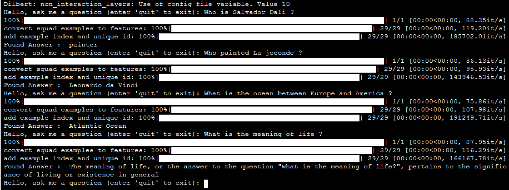

# Delaying Interaction Layers in Transformer-based Encoders for Efficient Open Domain Question Answering

This repository contains the code to reproduce the results from the paper [Delaying Interaction Layers in Transformer-based Encoders for Efficient Open Domain Question Answering](https://arxiv.org/abs/2010.08422) and useful resources for extractive question answering, open domain question answering (ODQA) on Wikipedia.

Some implementations (in particular the DIL mechanism) will be improved for a better genericity and a better interfacing with Huggingface's models.

If you use this code, please cite : 

```
@misc{siblini2020delaying,
      title={Delaying Interaction Layers in Transformer-based Encoders for Efficient Open Domain Question Answering}, 
      author={Wissam Siblini and Mohamed Challal and Charlotte Pasqual},
      year={2020},
      eprint={2010.08422},
      archivePrefix={arXiv},
      primaryClass={cs.CL}
}
```

## Requirements

The code runs with python 3.6, cuda 9.0, cudnn 7 (it can also work with other versions but we only ran it on these ones).

You can install the main requirements as follows :

```
pip install tensorflow-gpu==1.12.0
pip install torch==1.5.0+cu92 -f https://download.pytorch.org/whl/torch_stable.html
pip install transformers==2.7.0
pip install pyserini==0.9.4.0
```

For pyserini, ``JDK version 11+`` is required.

## Dilbert and Dilalbert

For now, we created separate python files for the implementation of ``DilBert`` (``dilbert.py``) and ``DilAlbert`` (``dilalbert.py``). We plan to implement a more generic class to include others models (e.g. Roberta, etc.). A big part of the code in these python files comes from the ``transformers library version 2.7.0`` and we added all the necessary lines to implement delayed interaction. Other functions, from the same library are also present in a other scripts in this repository. 

The forward function of ``DilBert`` and ``DilAlbert`` takes the same input as ``BertForQuestionAnswering`` and ``AlbertForQuestionAnswering`` (question and paragraph concatenated) to ensure compatibility with the ``run_squad.py`` script. Therefore, its starts by splitting the input, and then perform all the computations to finally output the start and end logits. To optimally exploit delayed interaction, we implemented two additionnal functions: processA (non interaction part) and processB (interaction part). There is an example of usage in the ``eval_time.py`` script described below. 


## eQA experiment

First start by unzipping ``SQuAD_1_1.zip`` at the root of the project. 

To evaluate the models for the extractive question answering task on SQuAD, we created two copies of huggingface's [run_squad.py script](https://github.com/huggingface/transformers/tree/master/examples/question-answering) :
* The first one is not modified and is used to train/evaluate the original bert and albert on
SQuAD.
* The second one is renamed ``run_squad_dil.py`` and is used to train/evaluate dilbert and dilalbert
on SQuAD.

The main difference is that in the second script the ``AutoModelForQuestionAnswering`` object has been modified to map a ``Bert`` (resp. ``Albert``) config to a ``Dilbert`` (resp. a ``Dilalbert``) model instead of a ``BertForQuestionAnswering`` (resp. an ``AlbertForQuestionAnswering``) and adds the "non_interaction_layers" argument.

To simplify the usage of the run_squad scripts, we created 4 files to run the main experiments:

* ``train_bert``: contains the command to run the training and the evaluation of bert (base english uncased). A single parameter is required (output folder). For example, you can type ``./train_bert bert_output_folder/`` in a terminal. This will run the train/eval command, save all the necessary files in ``bert_output_folder`` (model, checkpoints, etc...), and finally display the evaluation results.

At the end of the process you should obtain a result close to: ``'exact': 81.02175969725639, 'f1':88.52084791459409``

* ``train_albert``: equivalent to ``train_bert`` but for albert, you can run it by typing ``./train_albert albert_output_folder/``.

Results should be close to: 'exact': ``83.28287606433302, 'f1': 90.53438278266508``

* ``train_dilbert``: equivalent to ``train_bert`` but for dilbert, you can run it by typing ``./train_dilbert dilbert_output_folder/``. You can edit ``--non_interaction_layers 10 \`` in the command in ``train_dilbert`` to set the number of non interaction layers. 

Results should be close to: 'exact': ``76.16840113528855, 'f1': 84.52591032935983`` for a number of non interaction layers k=10

* ``train_dilalbert``: equivalent to ``train_dilbert`` but for dilalbert, you can run it by typing ``./train_dilalbert dilalbert_output_folder/``. Similarly to dilbert, you can edit ``--non_interaction_layers 10 \`` in ``train_dilalbert``.

Results should be close to: 'exact': ``78.77010406811732, 'f1': 87.06184364043625`` for k=10

## ODQA on OpenSQuAD

Here we explain how to evaluate the proposed end-to-end approach for open domain question answering on ``OpenSQuAD`` (answering to questions using the entire English Wikipedia).

Before running ODQA experiments, you need to prepare the data (get the wikipedia dump, preprocess it, index it with pyserini).

### Data preparation

A data file (Wikipedia dump from (Chen et al., 2017)) is required to run the experiments in this section. You can download it by running the script ``download.sh`` from [the DrQA repository](https://github.com/facebookresearch/DrQA/blob/master/download.sh):

You'll obtain an archive containing many files. The only file that we are interested in is ``docs.db`` in the ``wikipedia`` folder. To transform it into the right json format for ``pyserini``, you can use the script ``prepare_files_for_opensquad.py`` (make sure ``DB_PATH`` is properly set to the location of ``docs.db``). This script uses functions from [the DrQA repository](https://github.com/facebookresearch/DrQA/blob/master/download.sh) (please check their License before usage).

```
python prepare_files_for_opensquad.py
```

The script should create a folder ``formatted_open_squad`` containing a pickle ``open_squad.pkl`` and two folders ``paragraphs_json`` and ``indexes``.

Then you can run pyserini's ``index`` script on the prepared paragraphs:

```
python -m pyserini.index -collection JsonCollection -generator DefaultLuceneDocumentGenerator -threads 1 -input formatted_open_squad/paragraphs_json/ -index formatted_open_squad/indexes/paragraphs_indexing -storePositions -storeDocvectors -storeRaw
```

At the end of this process, you shoud see something like :

```
============ Final Counter Values ============
INFO [main] index.IndexCollection (IndexCollection.java:876) - indexed: 34,654,599
INFO [main] index.IndexCollection (IndexCollection.java:877) - unindexable: 0
INFO [main] index.IndexCollection (IndexCollection.java:878) - empty: 0
INFO [main] index.IndexCollection (IndexCollection.java:879) - skipped: 0
INFO [main] index.IndexCollection (IndexCollection.java:880) - errors: 0
INFO [main] index.IndexCollection (IndexCollection.java:883) - Total 34,654,599 documents indexed in 00:56:27
```

You now have everything you need for the ODQA experiments.

### ODQA experiments

The script to run the ODQA experiment is ``run_opensquad.py`` :

```
python run_opensquad.py --bert_path bert_output_folder/ --dilbert_path dilbert_output_folder/ --albert_path albert_output_folder/ --dilalbert_path dilalbert_output_folder/ --device cuda
```

Make sure to properly set the path to eQA models in the options. If you want to run the experiment on cpu, set device to ``cpu`` instead of ``cuda``. 

During the benchmark, the script will write the results in the file ``bench_results.txt``. It should look like that:

```
Bert
k = 29
Using IR score with mu = 0.5
Running evaluation on 10570 predictions
exact_match: 43.49101229895932, f1: 50.92238073071992
IR : 0.7461684011352886
Bert
k = 29
Not using IR score
Running evaluation on 10570 predictions
exact_match: 37.38883632923368, f1: 44.10358118288392
IR : 0.7461684011352886
Bert
k = 100
Using IR score with mu = 0.5
Running evaluation on 10570 predictions
exact_match: 44.34247871333964, f1: 51.842290765649715
IR : 0.823841059602649
Bert
k = 100
Not using IR score
Running evaluation on 10570 predictions
exact_match: 31.797540208136233, f1: 37.97127355712161
IR : 0.823841059602649

...

...

...

```

Important note: the purpose of this script is to measure the quality of answers (F1, EM, R) so the code has not been optimized here to benefit from the possibility to save computations with the dil mechanism. To measure time saving with an optimized pipeline, check out the ``eval_time.py`` script below. 

## Time consumption

We implemented a script to evaluate the speedup entailed by delayed interaction. This script considers 100 questions and 100 arbitrary paragraphs and measures the total time required by ``Bert``, ``Albert``, ``Dilbert``, and ``Dilalbert`` to search for the answer of each question in all paragraphs. For dilbert and dilalbert, the script details the time required to do the independent processing on questions and paragraphs (NI Q and NI P) and the dependant processing on question-paragraph pairs (I Q-P). The speedup is also computed. To run the script, just type:

```
python eval_time.py
```

Make sure to properly set the parameters in the script :

```
BERT_PATH = 'bert_output_folder/'
DILBERT_PATH = 'dilbert_output_folder/'
ALBERT_PATH = "albert_output_folder/"
DILALBERT_PATH = 'dilalbert_output_folder'
OPEN_SQUAD_PATH = 'formatted_open_squad/open_squad.pkl'
WIKI_INDEX_PATH = 'formatted_open_squad/indexes/paragraphs_indexing'
USED_DEVICE = "cpu" #or "cpu"
```

## Ask wiki

We finally provide a simple script ``ask_wiki.py`` to play with the ODQA pipeline. It is an infinite loop where you can ask any question and get an answer from Wikipedia. Before running it, make sure that the parameters are properly set :

```
PATH_TO_WIKI_INDEX = 'formatted_open_squad/indexes/paragraphs_indexing'
PATH_TO_DILBERT = 'dilbert_output_folder/"
DEVICE_COMP = "cuda" #or "cpu"
```



This question-answering tool can easily be implemented as a service in python ``Flask`` server.

## References

The implementations were made possible thanks to several libraries:

* [HuggingFace Transformers](https://huggingface.co/)
* [pyserini](https://github.com/castorini/pyserini/)
* [SQuAD](https://rajpurkar.github.io/SQuAD-explorer/)
* [DrQA and Wikipedia Dump](https://github.com/facebookresearch/DrQA/)

For others references (Bert, Albert, etc.), please check [the paper](https://arxiv.org/abs/2010.08422).
